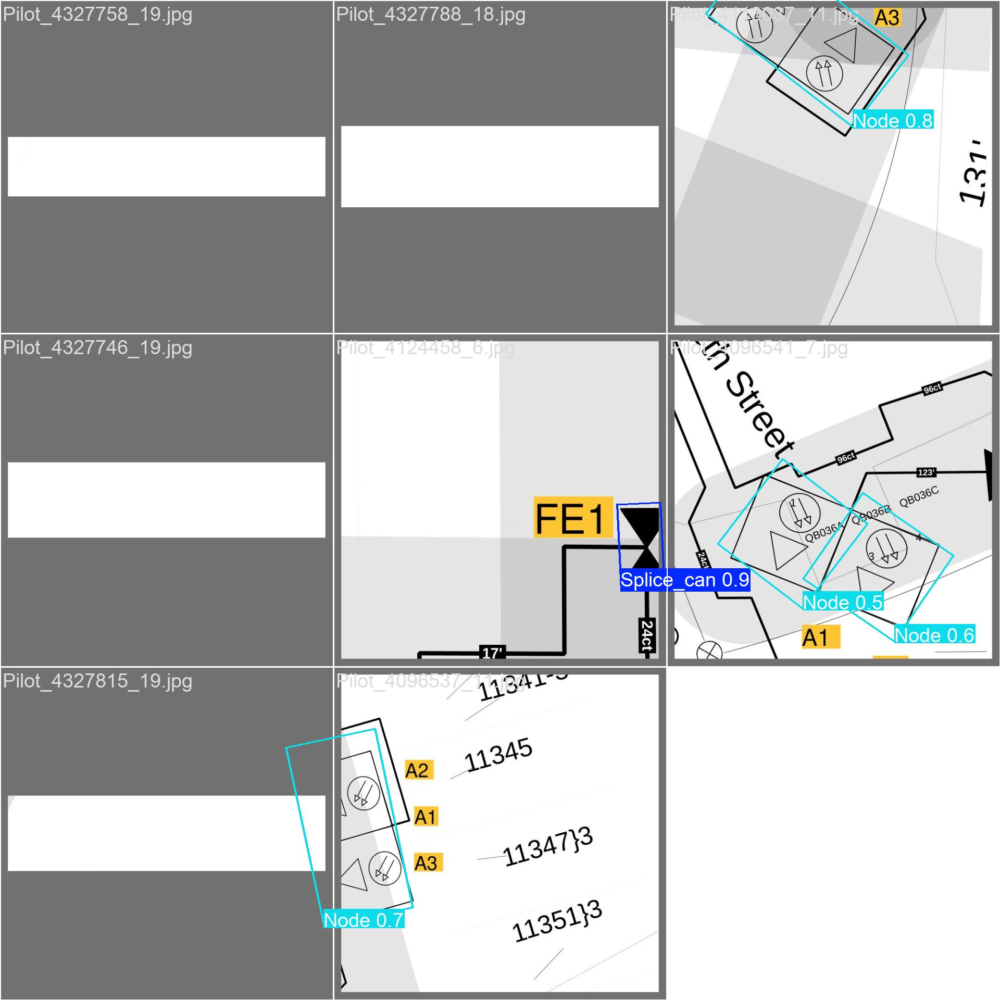
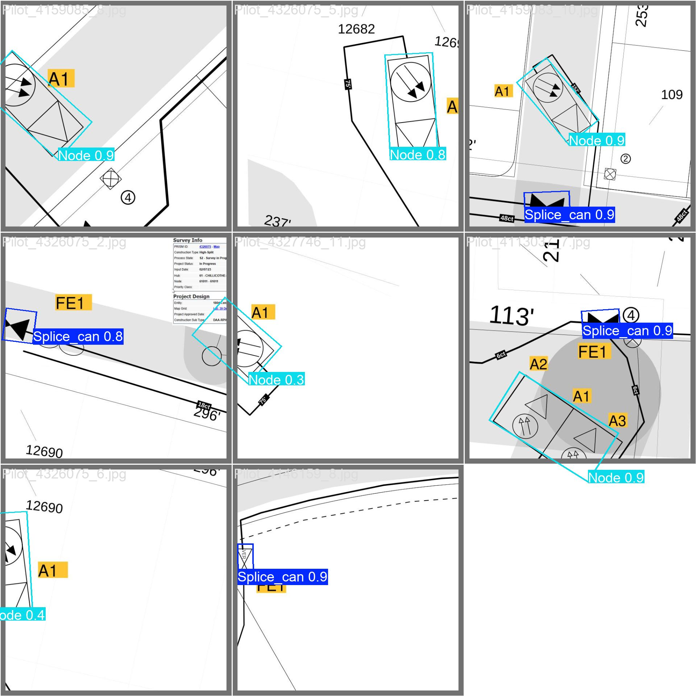
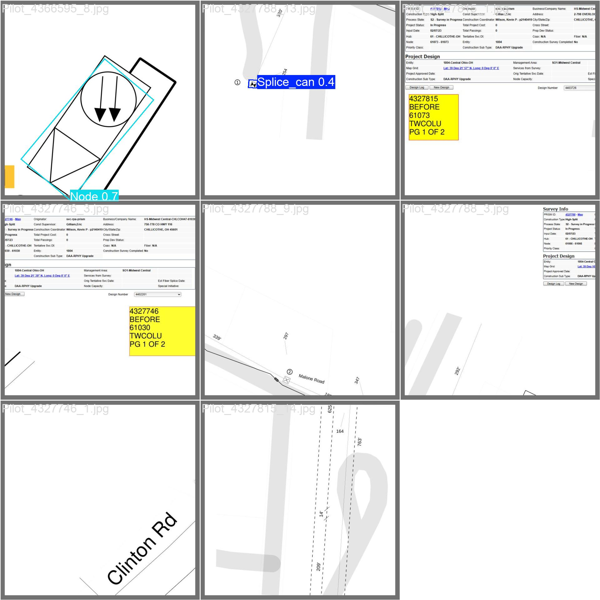

# Fiber Splice & Node Detection

This project automated the detection of fiber optical utility symbols—specifically **Splice Cans** and **Nodes**—from large operational maps using advanced computer vision object detection techniques.

## Tech Stack
- **Deep Learning Framework:** PyTorch & Ultralytics YOLOv8
- **Architectures:** YOLOv8 Large (`yolov8l`) and YOLOv8-OBB Large (`yolov8l-obb`)
- **Data Processing:** OpenCV, XML ElementTree
- **Environment:** Conda / Python 3.x
- **Annotation Format:** CVAT XML

## Working Methodology

The pipeline involves three primary components:

1. **Dataset Conversion & Preprocessing**:
   - The original dataset contained image patches with bounding box annotations in CVAT XML format. Many of the map elements (especially Splice Cans) were rotated.
   - **`convert_data.py` & `convert_data_obb.py`**: Custom Python scripts were written to parse the CVAT XMLs. For the standard YOLO model, mathematical rotations were computed to create tight Axis-Aligned Bounding Boxes (AABB). For the OBB model, the `(xtl, ytl, xbr, ybr, rotation)` properties were mapped into the 4-corner polygon format (`x1 y1 x2 y2 x3 y3 x4 y4`) required by YOLO-OBB. Data was automatically split 80/20 into train/validation sets.

2. **Model Training**:
   - Standard YOLOv8 and YOLOv8-OBB models were trained over multiple iterations.
   - `data.yaml` and `data_obb.yaml` configurations tracked two classes: `0: Splice_can` and `1: Node`.
   - Training processes logged metrics automatically to the `runs/` directory for monitoring loss and mAP.

3. **Inference Pipeline**:
   - **`run_inference.py` / `debug_inference.py`**: Developed to interpret the high-resolution maps. Since map PDFs/images are too large to process in a single pass without downsampling (which destroys the symbol fidelity), these scripts employ a tiling strategy. The maps are sliced, fed through the model, and then predictions are carefully aggregated and plotted back onto the full-scale image.

## Training Results

The clear winner across multiple experiments was the **YOLOv8-OBB** (Oriented Bounding Box) model (`fiber_yolov8l_obb`). Because Splice Cans are frequently heavily rotated on circuit maps, a standard bounding box would aggressively overlap with nearby geometry, confusing the standard model. The OBB approach successfully captured the symbols tightly, regardless of orientation.

**Best Model Metrics (YOLOv8-OBB - Epoch 100):**
- **Precision:** ~1.000
- **Recall:** ~0.961
- **mAP50:** ~0.995
- **mAP50-95:** ~0.763

## Validation Images

Below are the predicted outputs from the validation set using the best YOLOv8-OBB model. They display how tightly the oriented bounding box captures the angled fiber splicing components.

### Batch 0 Predictions

### Batch 1 Predictions

### Batch 2 Predictions

